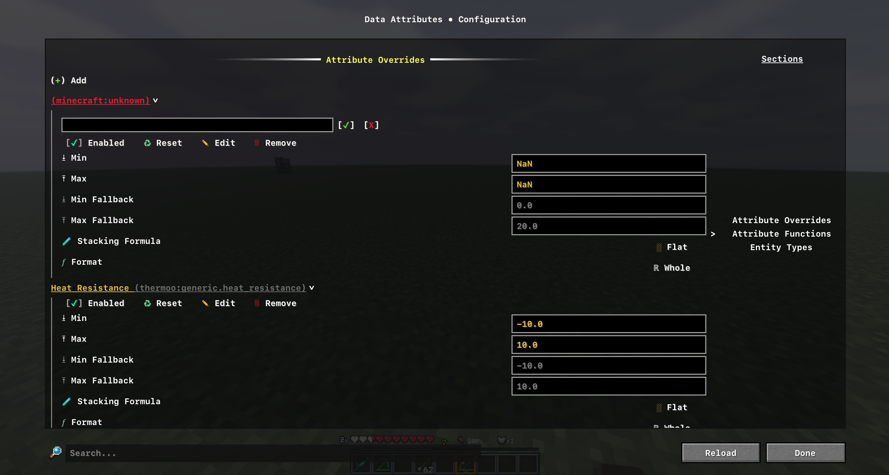
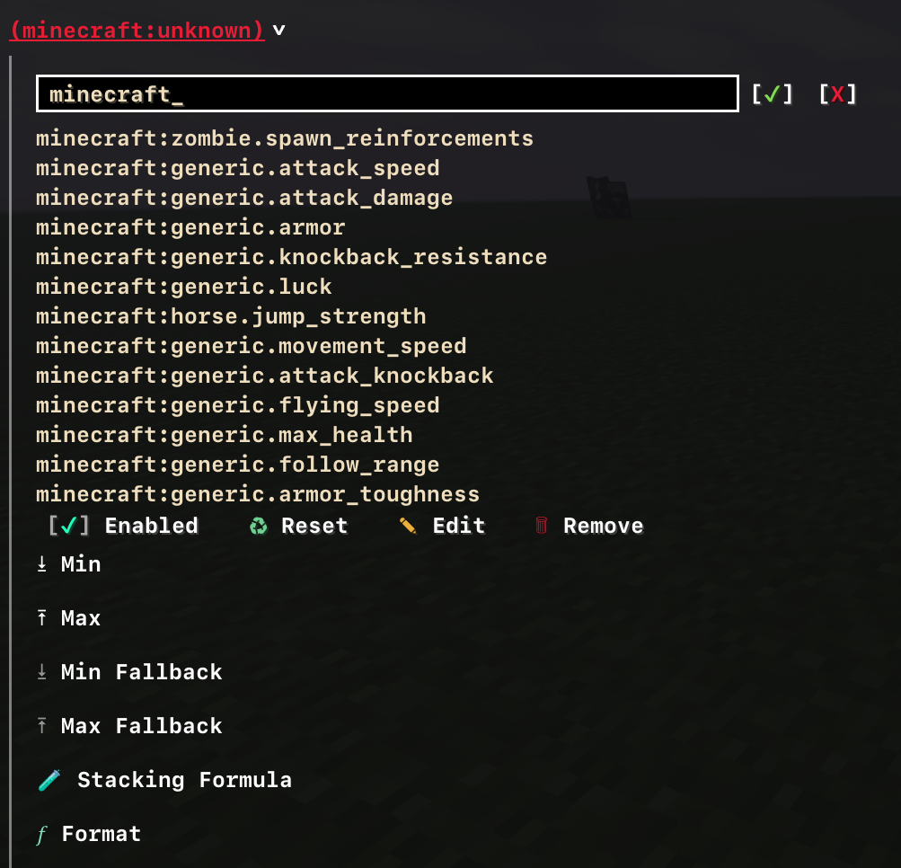
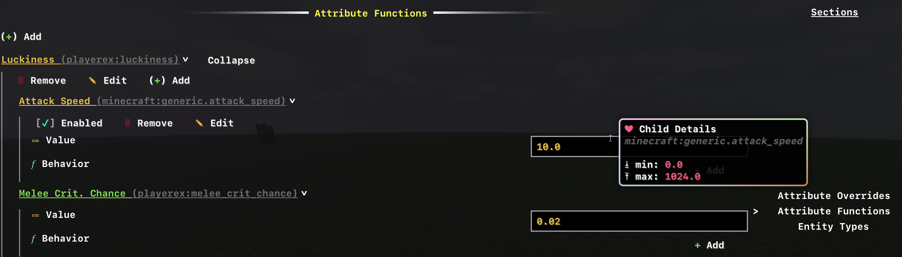
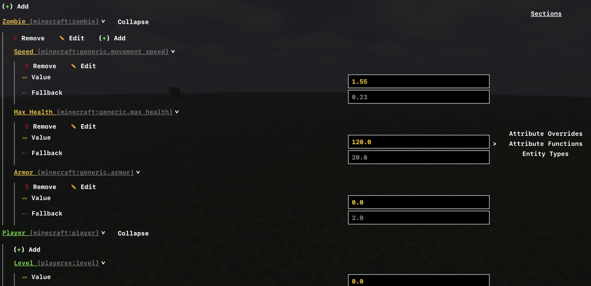

!!! abstract ""
    This section provides an overview of the datapack and config structure used by Data Attributes.

### Datapack Structure

Data Attributes can use Minecraft’s data resource system. The file hierarchy for this is `data/namespace/data_attributes`.

Where `namespace` is either the default `minecraft` or any given mod-id.

By default, nothing exists in this directory, as all json data is optional.
However, a fully populated directory contains the following folders:

- `overrides` (for Attribute Overrides)
- `functions` (for changing the behavior and operations of an attribute based on a parent with modifiers)
- `entity_types` (for attaching attributes and/or modifying their current base attribute values)

#### Datapack Files

```txt
📂data
 ┗📂<namespace>
   ┗📂data_attributes
     ┣📂overrides
     ┃ ┣📄any_name.json
     ┃ ┗...
     ┣📂functions
     ┃ ┣📄any_name.json
     ┃ ┗...
     ┣📂entity_types
     ┃ ┣📄any_name.json
     ┃ ┗...
 ┣⚙️pack.mcmeta
 ┗...
```

#### Format (Datapacks & Configs)

##### Attribute Overrides

```json
{
 "entries": {
  "namespace:path": {
   "enabled": true,
   "min": 0.0,
   "max": 1024.0,
   "smoothness": 0.0,
   "min_fallback": 0.0,
   "max_fallback": 20.0,
   "formula": "Flat/Diminished",
   "format": "Whole/Percentage"
  },
 }
}
```

##### Attribute Functions

```json
{
 "entries": {
  "parent_namespace:parent_path": {
   "child_namespace:child_path": {
    "enabled": true,
    "behavior": "Add/Multiply",
    "value": 0.0
   }
  }
 }
}
```

##### Entity Types

```json
{
 "entries": {
  "entity_namespace:entity_path": {
   "attribute_namespace:attribute_path": {
    "value": 0.0,
    "fallback": 0.0
   }
  }
 }
}
```


### Config Structure

Data Attributes also has configuration files. These are found in your game instance folder in `config/data_attributes`.

These are your **primary changes**, they will **always overwrite** any changes that come from data-packs. Users can apply changes they wish to see in-game quickly using either the interface, or the `json5` files, and then reloading their changes.

#### Config Files

```txt
📂config
 ┗📂data_attributes
  ┃ ┣📄overrides.json5
  ┃ ┣📄functions.json5
  ┃ ┗📄entity_types.json5
```

#### Using the Config Interface

##### General Overview
  
The interface was created to allow users to easily edit and apply what Data Attributes offers, such as overrides, attribute attachments to entities, and applying modifiers with different operations through 'functions'.

This allows for greater flexibility and a different, more intuitive option then using just `json` files, and comes feature-rich with autocompletion, reset and deletion abilities, and validation with helpful tooltips.

<figure markdown="span">
  
  <figcaption>A general look at the Data Attributes interface.</figcaption>
</figure>

##### Features

###### Autocompletion

The interface comes with autocompletion of attribute and entity-type ids, allowing you to target currently registered ones.

<figure markdown="span">
  
  <figcaption>Autocompletion while editing an id on a ui entry.</figcaption>
</figure>

###### Adding

The interface comes with the ability to add your own entries, using the (+ Add) button. This creates a entry in the interface, that will state `minecraft:unknown`. You are meant to edit and fill in with a proper attribute id.

###### Editing

You are able to edit the ids of entries, allowing for you to select a different target.

In some cases, it fills in extra context that you need to know about a specific entry (such as fallbacks for an override).

###### Removing

Removal of config entries are also possible in the interface. Pressing the button removes a specific entry, and removing a top-level entry removes everything else under it.
This is excluding default entries, as those are not meant to be removed. They are supplied through another source (via. data-packs or mods).

###### Searching

You are able to search for specific attribute ids through their respective **translation**, or the raw id itself.

- For english, **Pig** would reference the entry `minecraft:pig` if it is an id that is present in the UI somewhere.

###### Saving and Reloading Changes

Reloading a change using the **Reload** button will not save your changes in the UI. This is meant to refresh your config with any recently applied `json5` changes.

In order to save your changes in the UI, you are to press **Done**. This will apply your changes to the `json5`, and then you can either join a world, extract the information, or use `/reload` if already in a world to see the changes.

<figure markdown="span">
  
  <figcaption>The footer of the config UI, which contains the search widget.</figcaption>
</figure>

##### Attribute Overrides

For overrides, you are able to see the current minimum and maximum value, along with **fallback (or originally set)** values of the attribute that were statically initialized.
This helps to give you an understanding of the intended ranges that this attribute was meant to fall under.

You are also able to see if an override is enabled or disabled, and can change this at will.

There is also the **Stacking Formula**, which you can change to either **`Flat`** or **`Diminished`**.
This is further explained in its own section.

You can also change how an attribute is formatted on the API by changing the **`Format`** option, which has two options, **`Whole` (the literal value)** or **`Percentage` (between the minimum and maximum range)**.

The **`Percentage`** option also supports **negative** values.
If you were to target an attribute ranged from `-100` (min) to `150` (max), and you wanted to display the value of an entity that was negative using the `DataAttributesAPI#getFormattedValue`, it will range from `0` to the negative minimum.

- In this example, if the entity's value was `-30`, it would show as `-30%`.

You are able to also **reset** overrides to their original settings, and it will apply its default settings and fallbacks.

##### Attribute Functions

For functions, you are able to change the literal **value** of a given child function, or **add new function children**. You are also able to **add new parents**, and enable and disable functions.

You can change the **Behavior** of how a function-child operates when its parent attribute increases on an entity. The options currently are **`Add`** and **`Multiply`**.
They are similar to Minecraft's `EntityAttributeModifier` operations.

- `Add` would represent `ADDITION`
- `Multiply` would represent `MULTIPLY_TOTAL`

<figure markdown="span">
  
  <figcaption>Example of how Attribute Functions look like on the interface.</figcaption>
</figure>

##### Entity Types

For entity-types, you are able to target specific entities and **modify their base-value**. If you wanted to give a zombie `60` base health, you can do this!

There is also a **`fallback`** value that is with the entity-type attribute entry, which shows the original base value loaded for that entity. If the value did not exist on an entity before, it will show as `0.0`.

<figure markdown="span">
  
  <figcaption>Example of how Entity Types look like on the interface.</figcaption>
</figure>
