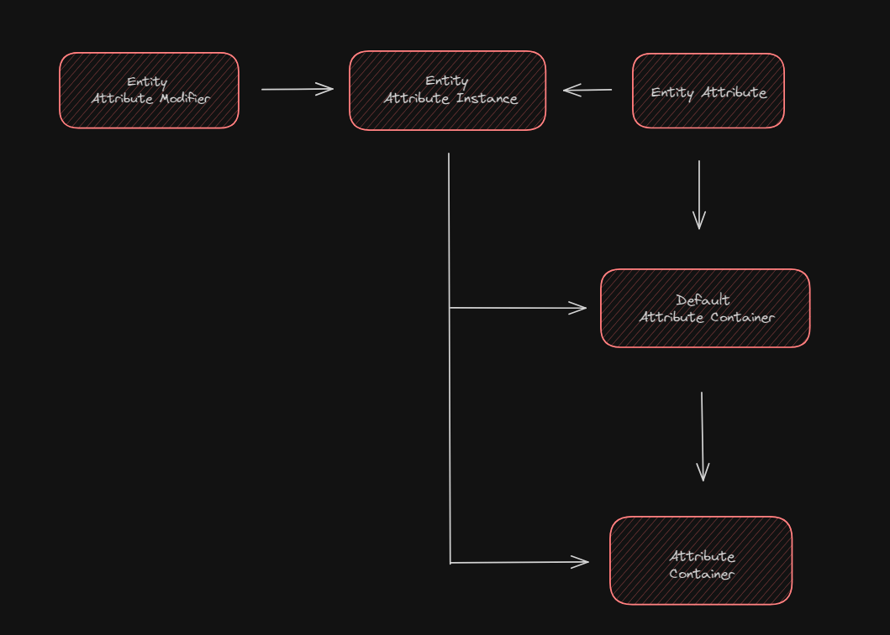

<!-- !!! tip ""
    **:octicons-clock-16: The Data Atrributes documentation is currently being rewritten - it is not accurate for versions >=3.4.2**

<br> -->

# Data Attributes


!!! abstract ""
    #### What is Data Attributes?
    Initially released for Minecraft 1.17.1 via the Fabric ecosystem, serves two main purposes: it revamps Minecraft's entity attribute system to be more flexible and inclusive of follow-on attributes, a feature common in many other games. Additionally, it enables the manipulation of entity attributes through datapacks, offering server and pack creators straightforward customization of every facet of the entity attribute system.

- ### Integrating Data Attributes

To add Data Atrributes to your project, begin by including our maven in the repositories block of your `build.gradle`

```groovy title="build.gradle"
repositories {
    maven {
        name = "Modrinth"
        url = "https://api.modrinth.com/maven"
        content {
            includeGroup "maven.modrinth"
        }
    }
}

dependencies {
    modImplementation "maven.modrinth:data-attributes-directors-cut:<version>"
}
```
Alternatively, if you're using Cursemaven:

```groovy title="build.gradle"
repositories {
    maven {
        name = "Cursemaven"
        url = "https://cursemaven.com"
    }
}

dependencies {
    modImplementation "curse.maven:data-attributes-directors-cut-955929:<version-file-id>"
}
```
Then, declare the dependency inside your `dependencies` block and as well as the version you want to use inside your `gradle.properties`.

=== "build.gradle"
    ```groovy 
    dependencies {
        modImplementation "maven.modrinth:data-attributes-directors-cut:<version>"
    }
    ```

=== "gradle.properties"
    ```
    data_attributes=1.6.0
    ```

If you want to use a version other than the most current one, check the [GitHub releases page](https://github.com/CleverNucleus/data-attributes/releases/)

- ### Specific Capabilities

Data Attributes allows you to customize all attributes using datapacks. It achieves this by separating attributes from the game instance and making them specific to each world. This means that attributes are not loaded or defined until a world is loaded, which offers greater flexibility and customization. This approach is significant because it changes how Minecraft handles attributes.

- #### Attributes in Vanilla Minecraft

Firstly, entity attributes `(of class EntityAttribute)`, also known as _attributes_, are simple data structures in Minecraft. They consist of a translation key, fallback value, minimum value, and maximum value, all of which cannot be changed once set (immutable). Attributes are registered (added) to the game statically when it is first loaded; registered here means that a _key_ `(of class Identifier)` is mapped to the _value_ that is the attribute. After all attributes are loaded, the static instances are used in-game as keys themselves.

Attribute instances `(of class EntityAttributeInstance)` are a wrapper data structure that holds three relevant objects: an attribute, which acts as a key or identifier for the attribute instance; a value, which is the mutable _current_ value that the attribute instance represents; and a map, which contains attribute modifiers that determine the value.

Attribute modifiers `(of class EntityAttributeModifier)` are another data structure that contains: a name; a uuid, which is used as a key/identifier for the modifier; an immutable value; and an operation (of class EntityAttribteModifier$Operation) that determines how the modifier is to use its value. 

The three operations are:

| Operation        | Result |
| -----------      | ------------------------------------ |
| `ADDITION`       | 𝔁 + 𝓿 |
| `MULTIPLY_BASE`  | 𝔁 + (𝔁~1~ × 𝓿) |
| `MULTIPLY_TOTAL` | 𝔁 × (1 + 𝓿) |

Where 𝔁 and 𝓿 are the attribute instance and attribute modifier values, respectively. Also of note is 𝔁~1~, which represents the attribute instance’s base value and any `ADDITION` modifiers; otherwise `MULTIPLY_BASE` and `MULTIPLY_TOTAL` would be the same.

Default attribute containers `(of class DefaultAttributeContainer)` are another data structure that holds a map of attributes and attribute instances. They are immutable and mapped to entity types (of class EntityType). The purpose of default attribute containers is to provide a collection of attributes and default attribute values different entities. 

When an entity `(of class LivingEntity in this case)` is first created, it is representative of an entity type, and therefore has a default attribute container assigned to it. This sets the entity’s default/starting health, for example.

However, default attribute containers are immutable, as previously mentioned. This is not suitable for changing attribute values i.e. modifiers. Therefore, Minecraft provides the attribute container `(of class AttributeContainer)`. This is a wrapper structure that holds a default attribute container as a fallback, as well as its own map of attributes and attribute instances. This map is mutable, and allows modifiers to be applied.

!!! note "Where “of class” is written, the class name is dependent on the mappings used."

- #### Attribute Hierarchy

<figure markdown="span">

<figcaption>Diagram of how components relate to create the attributes system.</figcaption>
</figure>

- #### Changes and Implementation

Although all attributes are as functional as each other in-game, some are added differently under the hood. Data Attributes splits attributes into two types: data driven, and hard coded. The latter refers not just to vanilla attributes, but to all modded ones as well `(so long as they are, well, hard coded).` 

Data driven attributes refers to those added through datapacks `(json files)`. The difference between these is that the hard coded attributes remain loaded for every world, and are not ever unregistered. This means that when using an attribute object reference in the code, the object existing in the registry is the same as the object in any given `attribute container`, or `attribute instance` etc. 

Whereas the data driven attribute is `world-dependent` and can be `unregistered` and `resynced`, meaning that the object existing in the registry is not always the same as the object existing in any given attribute container or similar.

To get around this issue, Data Attributes uses identifiers `(Identifier)` to hold attributes in attribute containers or attribute instances etc. While the attribute _object_ may change, the attribute _identifier_ does not, even on reload and resync. 

This is at the core of what Data Attributes does: it simply changes the `attributes system` to use the attribute `identifier` instead of the attribute _object_, thereby allowing a fully dynamic, data driven attributes system.