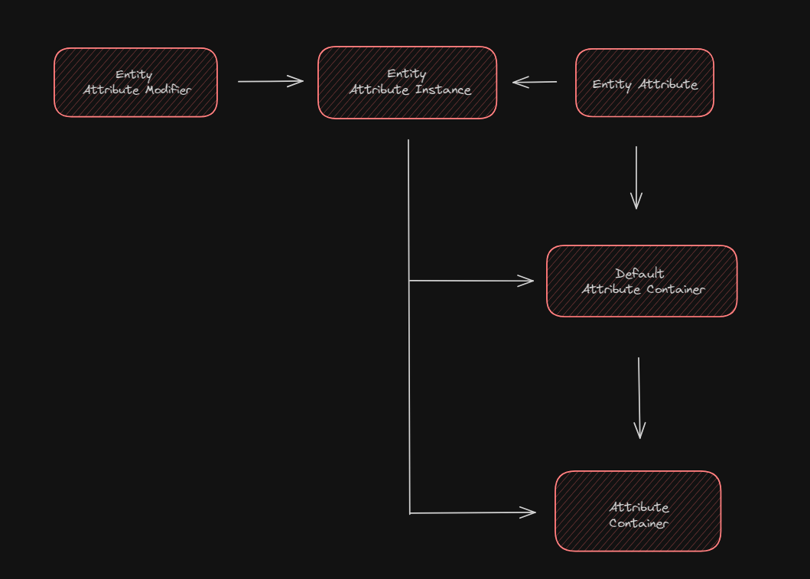

<!-- !!! tip ""
    **:octicons-clock-16: The Data Atrributes documentation is currently being rewritten - it is not accurate for versions >=3.4.2**

<br> -->

# Data Attributes


!!! abstract ""
    #### What is Data Attributes?
    Initially released for Minecraft 1.17.1 via the Fabric ecosystem, serves two main purposes:

    - Revamps Minecraft's entity attribute system to be more flexible and inclusive of follow-on attributes, a feature common in many other games.
    - Enables the manipulation of entity attributes through data-packs and a main configuration, offering server and pack creators straightforward customization of every facet of the entity attribute system.

- ### Integrating Data Attributes

To add Data Atrributes to your project, begin by including our maven in the repositories block of your `build.gradle`

```groovy title="build.gradle"
repositories {
    maven {
        name = "Modrinth"
        url = "https://api.modrinth.com/maven"
        content {
            includeGroup "maven.modrinth"
        }
    }
}

dependencies {
    modImplementation "maven.modrinth:data-attributes-directors-cut:<version>"
}
```
Alternatively, if you're using Cursemaven:

```groovy title="build.gradle"
repositories {
    maven {
        name = "Cursemaven"
        url = "https://cursemaven.com"
    }
}

dependencies {
    modImplementation "curse.maven:data-attributes-directors-cut-955929:<version-file-id>"
}
```
Then, declare the dependency inside your `dependencies` block and as well as the version you want to use inside your `gradle.properties`.

=== "build.gradle"
    ```groovy 
    dependencies {
        modImplementation "maven.modrinth:data-attributes-directors-cut:<version>"
    }
    ```

=== "gradle.properties"
    ```
    data_attributes=1.6.0
    ```

If you want to use a version other than the most current one, check the [GitHub releases page](https://github.com/CleverNucleus/data-attributes/releases/)

- ### Capabilities

The mod allows customization of attributes and how they behave through configuration files and data-packs.
Users of the mod can construct data-packs that are mod or world specific, while server hosts and individual players can utilize the config to adjust values that they want, and have them synchronize across all worlds in the instance.

The way attributes are handled are changed through this mod, allowing for greater flexibility by changing and adding minimum and maximum ranges. 
Using the new config interface, users can add new entries with ease, and adjust values while in-game.

- #### Attributes in Vanilla Minecraft

Firstly, entity attributes `(of class EntityAttribute)`, also known as _attributes_, are simple data structures in Minecraft. They consist of a translation key, fallback value, minimum value, and maximum value, all of which cannot be changed once set (immutable). Attributes are registered (added) to the game statically when it is first loaded; registered here means that a _key_ `(of class Identifier)` is mapped to the _value_ that is the attribute. After all attributes are loaded, the static instances are used in-game as keys themselves.

Attribute instances `(of class EntityAttributeInstance)` are a wrapper data structure that holds three relevant objects: an attribute, which acts as a key or identifier for the attribute instance; a value, which is the mutable _current_ value that the attribute instance represents; and a map, which contains attribute modifiers that determine the value.

Attribute modifiers `(of class EntityAttributeModifier)` are another data structure that contains: a name; a uuid, which is used as a key/identifier for the modifier; an immutable value; and an operation (of class EntityAttribteModifier$Operation) that determines how the modifier is to use its value. 

The three operations are:

| Operation        | Result |
| -----------      | ------------------------------------ |
| `ADDITION`       | 𝔁 + 𝓿 |
| `MULTIPLY_BASE`  | 𝔁 + (𝔁~1~ × 𝓿) |
| `MULTIPLY_TOTAL` | 𝔁 × (1 + 𝓿) |

Where 𝔁 and 𝓿 are the attribute instance and attribute modifier values, respectively. Also of note is 𝔁~1~, which represents the attribute instance’s base value and any `ADDITION` modifiers; otherwise `MULTIPLY_BASE` and `MULTIPLY_TOTAL` would be the same.

Default attribute containers `(of class DefaultAttributeContainer)` are another data structure that holds a map of attributes and attribute instances. They are immutable and mapped to entity types (of class EntityType). The purpose of default attribute containers is to provide a collection of attributes and default attribute values different entities. 

When an entity `(of class LivingEntity in this case)` is first created, it is representative of an entity type, and therefore has a default attribute container assigned to it. This sets the entity’s default/starting health, for example.

However, default attribute containers are immutable, as previously mentioned. This is not suitable for changing attribute values i.e. modifiers. Therefore, Minecraft provides the attribute container `(of class AttributeContainer)`. This is a wrapper structure that holds a default attribute container as a fallback, as well as its own map of attributes and attribute instances. This map is mutable, and allows modifiers to be applied.

!!! note "Where “of class” is written, the class name is dependent on the mappings used."

- #### Attribute Hierarchy

<figure markdown="span">

<figcaption>Diagram of how components relate to create the attributes system.</figcaption>
</figure>

- #### Changes and Implementation

Although all attributes are as functional as each other in-game, some are added differently under the hood.
As of Data Attributes `2.*.*` and above, attributes that are **statically registered** are usually the only ones that are meant to be targeted, due to concerns with instability on dynamically unregistering attributes.

Changes to attributes through either the config, or data-packs can be reloaded while in an instance.

- ##### Singleplayer Instances
An individual in their own world can make changes on the interface or config directly through the `json` files, and use the `/reload` command.

- ##### Server/Multiplayer Instances
A server maintainer or owner can make changes through the config `json`, and use the `/reload` command.

By using the `/reload` command, data-attributes will reload all configurations to reflect the updated config and apply the needed changes.
For data-packs, any adjustments to them will also be applied. Data-packs are secondary to the main config, and can be overwritten by it.

Data Attributes also uses **attribute ids** to hold attributes in attribute containers or attribute instances etc. While the attribute _object_ may change, the **id** does not, even on reload and resync. 

!!! note "This is at the core of what Data Attributes does: it mixes into attributes and their instances, exposing their ability to have their behaviors and ranges changed, allowing a fully dynamic, data-driven attributes system."