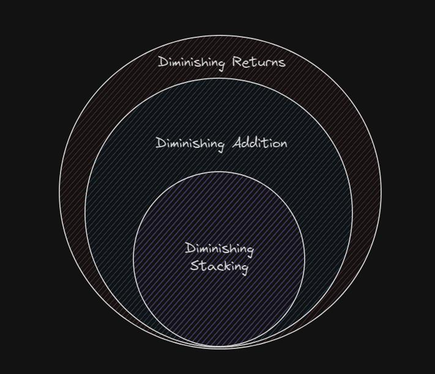
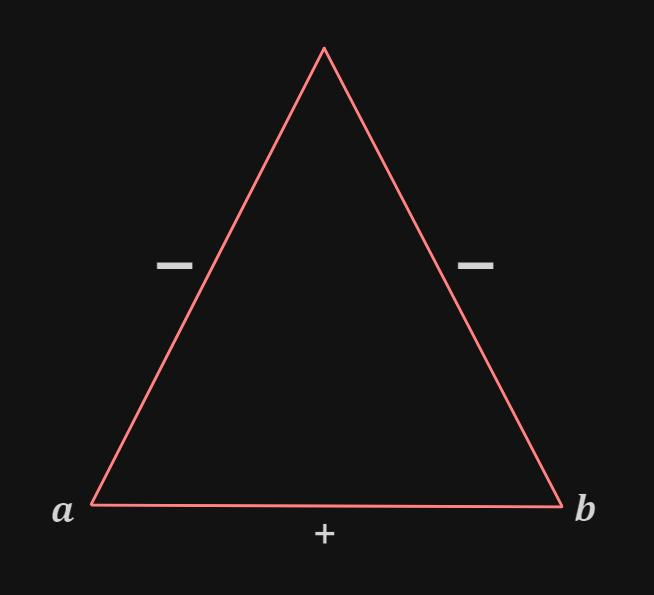

!!! abstract ""
    This section covers Stacking Behaviour, including: what it means; what it does; and how it's different from previous releases.

- ### Overview

Stacking behaviour describes how attribute values add together. This is primarily a binary operator set as `FLAT` or `DIMINISHING`. Every attribute has a stacking behaviour.

- #### The Problem

Without context, stacking behaviour may at first seem like some arbitrary overcomplication that serves no real purpose. However, stacking behaviour aims to solve a problem that arises with increased attribute configurability.

By default, attributes add together linearly; if the total value of the attribute exceeds its maximum, the value is simply clamped. This works for most cases in Minecraft, but by expanding the attributes system a new need is revealed: diminishing returns. 

This is a term given to attributes that when increased, increase nonlinearly and with respect to their maximum value `(the limit`). This is actually not a new concept - many games have diminishing returns with their attributes: Dota 2 with Evasion, for example.

The goal is that when an attribute exists that has a maximum value `(usually a value of 1, and usually percentage based)`, it can be desirable to have diminishing returns such that infinity can be added to the attribute and its value still not reach its limit

- #### The Solution

Firstly, it is important to differentiate between the two subsets of diminishing returns: ``diminishing addition and diminishing stacking``. The former is when no matter how great a value is added to the attributes, its value never reaches its limit, and furthermore the result is scaled depending on how great the addition was and how close to the limit the current value is. The latter is when two different sources of the same attribute are added, and the attributes value never reaches its limit.

The difference is subtle, but it boils down to whether the addition was from multiple different sources or not. What are different sources? An example of different sources is Iron Boots providing `+2 Armor`, and an Iron Chestplate providing `+6 Armor`.

<figure markdown="span">
 
<figcaption>Diminishing addition always encompasses diminishing stacking, but the reverse is not true.</figcaption>
</figure>

Secondly, the implementation of diminishing returns must be reversible and commutative. This means that the order in which multiple values are added should be irrelevant.

$$ f(a,b)=f(b,a) $$  

`Reversibility` here refers to how the addition function handles negative numbers. For example, given two numbers `𝒂 and 𝒃` add together to produce `𝒄`, either input subtracted from `𝒄` should result in the other input. This may seem obvious at first, but this is actually a substantial hurdle in creating a working diminishing attributes system, as often the `addition function` cannot or does not consider negative numbers.

<figure markdown="span">

<figcaption>Adding a and b produces c, just as subtracting a from c produces b.</figcaption>
</figure>

Thirdly, the implementation of diminishing returns can be very different. Indeed, this implementation has changed for every major version of Data Attributes.

!!! note "A limit of 1.0 has been assumed throughout this explanation."

- #### Changes from Previous Releases

The first release of Data Attributes included diminishing addition; however, the formula was `non-reversible and not commutative`. Because of this, the next update changed the system to use diminishing stacking only. This too, had its issues. While it worked as intended, the lack of diminishing addition was apparent and posed a problem. 

The advantage of the first system was that no matter how large any single value added was, it always `scaled depending on the limit.`

Whereas with the second iteration this was only a feature with different sources of the attribute. The third iteration (of which you are presently reading) reimplemented finally `diminishing addition`, while maintaing reversibility and being commutative.

- #### Behavior

**Stacking Behavior is split into the following:**

The `FLAT` stacking behaviour describes normal addition and functions as:

$$ a + b = r $$

Where 𝒂 and 𝒃 are the attribute values and 𝒓 is the result. For example, you have an Iron Helmet that provides `+2 armor` and an Iron Chestplate that `provides +6`. When added together you get `8 armor`.

$$ 2+6=8 $$

The `DIMINISHING` stacking behaviour describes a `non-linear addition function`, and only works for attributes with a minimum value of between `-1 and 0` (all inclusive), and a `maximum value of 1` (inclusive). This is primarily useful for percentage based attributes. The exact maths behind this is slightly complex, but it can be broadly summarised with the following equation:

$$ (1-v_2)\times(1-m)^\frac{v-v_2}{m}-(1-k_2)\times(1-m)^\frac{k-k_2}{m}=r $$

Where 𝒓 is the result; 𝓶 is the attribute’s `increment value`; and 𝓿, 𝓴, 𝓿~2~ and 𝓴~2~ are as follows:

$$ v=\sum_{}^{} |x|\;\;\{x<0\} $$

$$ k=\sum_{}^{} |x|\;\;\{x>0\} $$

$$ v_2=\max(|x|)\;\;\{x<0\} $$

$$ k_2=\max(|x|)\;\;\{x>0\} $$

!!! note "𝓿~2~ and 𝓴~2~ do not consider the attribute’s parent values."

Let’s look at what happens when we have an Iron Helmet that provides `+20% Evasion`, an Iron Chestplate that provide `+30% Evasion` and a negative potion effect that gives `-10% Evasion` (an assumption we make is that Evasion’s `minimum value is 0`, `maximum value is 1`, and `increment value is 0.01`):

$$ (1-0.1)\times(1-0.01)^\frac{0.1-0.1}{0.01}-(1-0.3)\times(1-0.01)^\frac{0.5-0.3}{0.01}=0.327 $$

In other words, `+30% +20% -10%` Evasion yields `+32.7%` Evasion in total. One could also view it as `+30% +20%` Evasion yields `+42.7%` Evasion, and then `-10%` Evasion lowers it to `+32.7%` Evasion.

Let’s also look at what happens to our `Knockback Resistance` wearing a full set of Netherite Armor if we change the stacking behaviour from `FLAT` to `DIMINISHING `(assuming that the `minimum value is 0`, `maximum value is 1` and `increment value is 0.01`)

Initially, a full set of Netherite Armor provides us with `+0.4`, or `+40 Knockback Resistance`. We know this is actually `x4 0.1 Knockback Resistance` modifiers.

$$ (1-0)\times(1-0.01)^\frac{0-0}{0.01}-(1-0.1)\times(1-0.01)^\frac{0.4-0.1}{0.01}=0.334 $$

So, where `+10% +10% +10% +10%` yielded `+40%`, it now yields `+33.4%` - a marked reduction. However, the benefit to gameplay here is that we can add as much `Knockback Resistance` as we want now without any individual source of the attribute becoming irrelevant.

