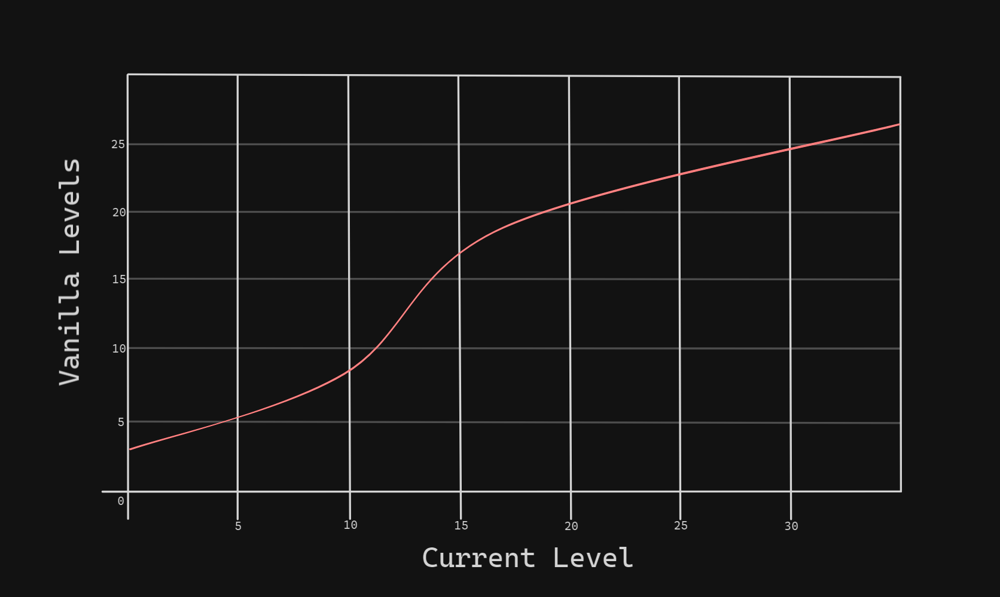

!!! abstract ""
    This page goes over commonly asked questions and provides some `examples` and `mini-tutorials`.

!!! note "It is advisable to see [Data Attributes](../data-attributes/datapack-setup.md) as well as to familiarise yourself with Minecraft's [datapack system](https://minecraft.fandom.com/wiki/Data_pack) before continuing."

- #### How do I customise the Levelling Formula?

The levelling formula is a mathematical function written as an expression that takes in one argument, $x$, and produces one output, $y$. By default, this function is expressed as follows:

$$y=stairs(x, 0.15, 2, 25, 10, 22)$$

Where $stairs(x,u,v,i,j,m)$ is provided by the equation below:

$$y=\min{(v\times u\times (x-i)-v\times \sin{(u\times (x-i))}+j}{,m)}$$

When plotting this as a graph, $x$ is the player's current PlayerEx level, and $y$ is how many experience vanilla levels is needed to get to the next PlayerEx level.

<figure markdown="span">
 
<figcaption>The default levelling formula.</figcaption>
</figure>

Using the graph, we can see that when first starting out it will take 1 vanilla experience level to gain a PlayerEx level. We can see that it will take 10 vanilla experience levels to gain another PlayerEx level while the player is at levels 20 - 30. Finally, we can see that the number of vanilla levels needed to gain another PlayerEx level is capped at 22.

When entering an expression into the config, some functions are supported out of the box such as $\sin$ and $\cos$ - see [here](https://www.objecthunter.net/exp4j/) for a list of supported functions and constants. Note that the $x$ variable, which represents the player's current PlayerEx level, *must* be included in your expression.

The following are examples of the expression entered into the config:

- #### The Default Formula

The default levelling formula, as discussed previously.

    stairs(x,0.15,2,25,10,22)

- #### A Constant Cost

This formula makes it so that it always takes `4 vanilla levels` to gain a `PlayerEx level`, regardless of how high a level you already are.

    x-x+4

- #### The Exponential Formula

This formula gives a relatively gentle exponential curve, where it costs `1 vanilla experience level` to gain the `first PlayerEx level`, and `21 vanilla experience levels` at `level 20`.

    1+0.05*x^2

!!! note "Be careful to only input the right side into the config i.e. not `y=..."

- #### How do I set a Max Level?

By default the maximum achievable level is set to $2^{31}-1$, but is realistically limited by the levelling formula and how much experience the player can get. The best method to set a maximum level is to set the level attribute's max value using a datapack. For this example we will set the maximum level to 50.

- #### File-Folder Structure

You need to create the following file-folder structure:


```
📂anything.zip
 ┣📄pack.mcmeta
 ┗📂data
   ┗📂playerex
     ┗📂attributes
       ┗📂overrides
         ┗📄level.json
```
Where `anything` can be named as you like - but it must not be `playerex` or `minecraft`.

- #### pack.mcmeta

Your `pack.mcmeta` file needs the following json code:

```java
{
    "pack": {
        "pack_format": 15,
        "description": [
            {
                "text": "ExamplePack",
                "color":"gold"
            },
            {
                "text": "\nbibi-reden/PlayerEx",
                "color":"yellow"
            }
        ]
    }
}
```

Take care to use the correct `pack_format` for the correct version of the game. For `1.20.1` it is 15.

- #### level.json

```java
{
    "fallbackValue": 0.0,
    "minValue": 0.0,
    "maxValue": 50.0,
    "incrementValue": 0.0,
    "translationKey": "playerex.attribute.name.level",
    "stackingBehaviour": "FLAT"
}
```

Now use the datapack in your world, and the max level is `50`.

- #### How do I set the player's starting Max Health?

You need to create the following file-folder structure:

```
📂anything.zip
 ┣📄pack.mcmeta
 ┗📂data
   ┗📂anything
     ┗📂attributes
       ┗📄entity_types.json
```

Where `anything` can be named as you like - but it must not be `playerex` or `minecraft`.

Follow the same `pack.mcmeta` from earlier above. 

- #### entity_types.json

Your `entity_types.json` file needs the following json code:

```java
{
    "values": {
        "minecraft:player": {
            "minecraft:generic.max_health": 6.0
        }
    }
}
```

Now use the datapack in your world, and the starting max health is ``6`.

- #### How do I Revert Melee Crit Behaviour to Vanilla?

PlayerEx subtly changes Minecraft's melee crit to be chance based, instead of on-jump. Furthermore, melee crit damage is also changed to be attribute based, instead of a `flat x1.5`. This behaviour can be reverted with a datapack.

You need to create the following file-folder structure:

```
📂anything.zip
 ┣📄pack.mcmeta
 ┗📂data
   ┗📂playerex
     ┗📂attributes
       ┣📄entity_types.json
       ┗📄functions.json
```

Follow the same `pack.mcmeta` from earlier above.

- #### entity_types.json Part 2

Your `entity_types.json` file needs the following json code:

```java
{
    "values": {
        "minecraft:player": {
            "playerex:level": 0.0,
            "playerex:constitution": 0.0,
            "playerex:strength": 0.0,
            "playerex:dexterity": 0.0,
            "playerex:intelligence": 0.0,
            "playerex:luckiness": 0.0,
            "playerex:evasion": 0.0,
            "playerex:lifesteal": 0.0,
            "playerex:health_regeneration": 0.0,
            "playerex:heal_amplification": 0.0,
            "playerex:ranged_crit_damage": 0.0,
            "playerex:ranged_crit_chance": 0.0,
            "playerex:ranged_damage": 0.0,
            "playerex:fire_resistance": 0.0,
            "playerex:freeze_resistance": 0.0,
            "playerex:lightning_resistance": 0.0,
            "playerex:poison_resistance": 0.0,
            "playerex:wither_resistance": 0.0,
            "playerex:breaking_speed": 1.0
        }
    }
}
```
This is exactly the same as the `entity_types.json` file that ships with PlayerEx, but without the two entries `"playerex:melee_crit_damage": 0.0,` and `"playerex:melee_crit_chance": 0.0,`.

- #### functions.json

Your `functions.json` file needs the following json code:

```java
{
    "values": {
        "playerex:constitution": {
            "minecraft:generic.max_health": 1.0,
            "minecraft:generic.knockback_resistance": 0.01,
            "playerex:poison_resistance": 0.01
        },
        "playerex:strength": {
            "minecraft:generic.attack_damage": 0.25,
            "minecraft:generic.armor": 0.5,
            "playerex:health_regeneration": 0.01
        },
        "playerex:dexterity": {
            "minecraft:generic.attack_speed": 0.1,
            "playerex:ranged_damage": 0.25,
            "playerex:lightning_resistance": 0.01
        },
        "playerex:intelligence": {
            "playerex:heal_amplification": 0.002,
            "playerex:ranged_crit_damage": 0.005,
            "playerex:wither_resistance": 0.01
        },
        "playerex:luckiness": {
            "minecraft:generic.luck": 0.1,
            "playerex:evasion": 0.02,
            "playerex:ranged_crit_chance": 0.02
        }
    }
}
```
This is exactly the same as the `functions.json` file that ships with PlayerEx, but without the two entries `"playerex:melee_crit_damage": 0.005,` and `"playerex:melee_crit_chance": 0.02,`.

Now use the datapack in your world, and the melee crit behaviour will be vanilla.

- #### Is there compatibility for darkmode GUI?

Yes, this can be done with a resource pack. Textures for compatibility with Vanilla Tweaks [Dark UI](https://vanillatweaks.net/picker/resource-packs/) are available [here](https://github.com/CleverNucleus/PlayerEx/tree/master/img/darkmode).

- #### How does the chunk-based experience system work?

Each chunk `(16x16 block area)` has three new numbers attached to it: the `Experience Negation Factor;` the `Restorative Force;` and the `Restorative Force Interval`. 

The goal of this system is to fix the problem of mob farms allowing for `infinite levels`. 

PlayerEx needed something that would limit `how much experience players` could collect in a given area in a given amount of time `i.e., mob farms`, whilst also not affecting modded dungeons which also use spawners.

- #### The Experience Negation Factor

This value defaults to `1.0` and essentially describes the chance for experience orbs to spawn. A value of `1.0` guarantees that experience orbs spawn and a value of `0.0` guarantees that experience orbs do not spawn. 

Everytime an experience orb successfully spawns in a chunk, it multiplies that chunk's Experience Negation Factor by a value that is less than one - in other words, it reduces the chunk's Experience Negation Factor.

This multiplier `(i.e., how rapidly the chance for experience orbs to spawn decreases)` is configurable; by default, the configurable multiplier value is `0.95`, but setting it to `1.0` causes this entire experience system to return to vanilla behaviour.

When the chunk's `Experience Negation Factor` is reduced to less than `1.0`, the chance for subsequent experience orbs to spawn in that chunk is also reduced.

- #### The Restorative Force

This value is a greater-than-one multiplier that acts to bring the chunk's `Experience Negation Factor` back up to `1.0`. 

Every `Restorative Force Interval`, the chunk's `Experience Negation Factor` is multiplied by its `Restorative Force.` This value is also configurable.

- #### The Restorative Force Interval

This value is the number of ticks between each `Restorative Event`. 

A `Restorative Event` is the term used to describe when a chunk's `Experience Negation Factor` is increased `(multiplied by the Restorative Force)`. It should be noted that `20 ticks is 1 second`. This value is configurable.