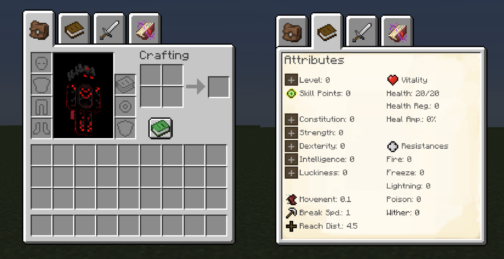
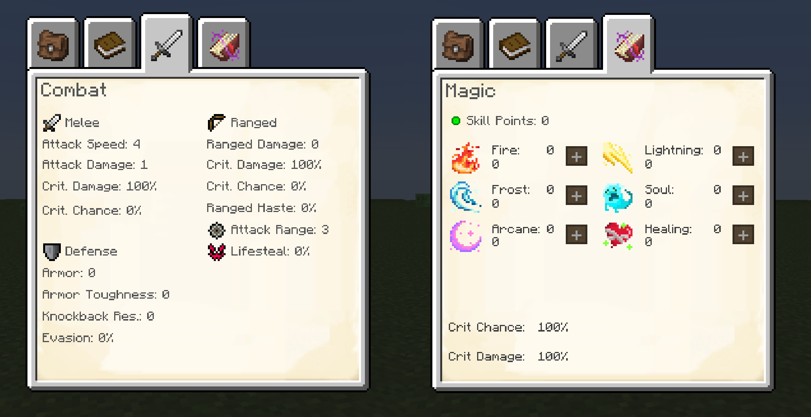

!!! abstract ""
    `PlayerEx` adds new `attributes` to the game, that are by default attached to the player. Additionally, PlayerEx features a new `GUI` screen and `levelling system.`

- #### Attributes

 PlayerEx adds fully functional attributes to the game. By default these attributes are only present on the player, but attributes with the **Applicable Entity** type `LivingEntity` can be attached to any living entity with datapacks - see [Data Attributes](../data-attributes/datapack-setup.md).

| Attribute Registry Key | Applicable Entity | Stacking Behaviour | Description |
| -------- | --------------- | ---------------- | ---------- |
| Evasion`playerex:evasion`| `LivingEntity` | `DIMINISHING` | The chance to dodge projectiles. |
| Lifesteal`playerex:lifesteal` | `LivingEntity` | `DIMINISHING` | A percentage of melee and ranged damage dealth is healed. |
| Health Regeneration`playerex:health_regeneration` | `LivingEntity` | `DIMINISHING` | Health passively healed every second. |
| Heal Amplification`playerex:heal_amplification` | `LivingEntity` | `DIMINISHING` | All healing is amplified by this amount. |
| Melee Crit Damage`playerex:melee_crit_damage` | `PlayerEntity` | `DIMINISHING` | Attack damage is multiplied by this amount on a melee critical hit. |
| Melee Crit Chance`playerex:melee_crit_chance` | `PlayerEntity` | `DIMINISHING` | The chance for a melee attack to be a critical hit. |
| Ranged Crit Damage`playerex:ranged_crit_damage` | `LivingEntity`| `DIMINISHING` | Projectile damage is multiplied by this amount on a rangd critical hit. |
| Ranged Crit Chance`playerex:ranged_crit_chance` | `LivingEntity`| `DIMINISHING` | The chance for a projectile fired to result in a critical hit. |
| Ranged Bonus Damage`playerex:ranged_damage` | `LivingEntity` | `FLAT` | Damage added to projectile base damage. |
| Fire Resistance`playerex:fire_resistance` | `LivingEntity` | `DIMINISHING` | Reduces fire damage by this amount (100% is immunity). |
| Freeze Resistance`playerex:freeze_resistance` | `LivingEntity` | `DIMINISHING` | Reduces freeze damage by this amount (100% is immunity). |
| Lightning Resistance`playerex:lightning_resistance` | `LivingEntity` | `DIMINISHING` | Reduces lightning damage by this amount (100% is immunity). |
| Poison Resistance`playerex:poison_resistance` | `LivingEntity` | `DIMINISHING` | Reduces poison damage by this amount (100% is immunity). |
| Wither Resistance`playerex:wither_resistance` | `LivingEntity` | `DIMINISHING` | Reduces wither damage by this amount (100% is immunity). |
| Breaking Speed`playerex:breaking_speed` | `PlayerEntity` | `FLAT` | Defines the player's base block breaking speed. |
| Level`playerex:level` | `LivingEntity` | `FLAT` | An RPG like level value attribute; does nothing. |
| Constitution`playerex:constitution` | `LivingEntity` | `FLAT` | An RPG like stat value used to increase other attributes: +1 Max Health +0.1 Knockback Resistance +0.1 Poison Resistance |
| Strength`playerex:strength` | `LivingEntity` | `FLAT` | An RPG like stat value used to increase other attributes: +0.25 Melee Attack Damage +0.5 Armor +0.01 Health Regen./s |
| Dexterity`playerex:dexterity` | `LivingEntity` | `FLAT` | An RPG like stat value used to increase other attributes: +0.1 Attack Speed +0.25 Ranged Damage +5% Melee Crit Damage +0.1 Lightning Resistance |
| Intelligence`playerex:intelligence` | `LivingEntity` | `FLAT` | An RPG like stat value used to increase other attributes: +2% Heal Amplification +5% Ranged Crit Damage +0.1 Wither Resistance |
| Luckiness`playerex:luckiness` | `LivingEntity` | `FLAT` | An RPG like stat value used to increase other attributes: +0.1 Luck +2% Evasion +2% Melee Crit Chance +2% Ranged Crit Chance |

- #### Modified Vanilla Attributes

| Attribute Registry Key | Modification |
| -------- | --------------- |
| Armor `minecraft:generic.armor` | Increased max value from 30 to `Integer.MAX_VALUE`. |
| Armor Toughness `minecraft:generic.armor_toughness` | Increased max value from 20 to `Integer.MAX_VALUE`. |
| Knockback Resistance `minecraft:generic.knockback_resistance` | Changed stacking behaviour from `FLAT` (default) to `DIMINISHING`. |
| Max Health `minecraft:generic.max_health` | Changed max value from 1024 to `Integer.MAX_VALUE`. |

- #### GUI

`PlayerEx` adds tabs to the survival inventory that let the player navigate between their inventory, attributes screen and combat attributes screen. 

The latter of which allow the player to view their attributes and spend skill points to level up and increase certain attributes. These have an RPG theme.

<figure markdown="span">
 
<figcaption>Added on inventory tabs and the main levelling tab.</figcaption>
</figure>

<figure markdown="span">
 
<figcaption>The Added on WizardEx Tab and the Combat Stat page. These can be also accesed with the R keybind.</figcaption>
</figure>

- #### Config Options

Most of PlayerEx's configurability is provided by `Data Attributes` in the form of datapacks, but there are some items that have a dedicated config - this is split into `server` and `client` items. The former requires restarting/reloading the world.

| Item | Side | Function |
| --- | -- | ------- |
| Reset On Death | `SERVER` | On death, the player's attributes, level and skill points revert to their defaults. |
| Disable Attributes GUI | `SERVER` | Hides inventory tabs, disables opening of/access to the attributes screen. |
| Show Level Nameplates | `SERVER` | For every `LivingEntity` with the Level attribute, a nameplate displays above that entity rendering their level (for players on multiplayer this is just above the head but below the nametag, such that it does not interfere with health bar mods). |
| Skill Points per Level | `SERVER` | How many Skill Points the player gets for each level up. |
| Level Up Formula | `SERVER` | Dictates how many experience levels are required for the player to level up. |
| Restorative Force Ticks | `SERVER` | The number of ticks between every restorative event. Note that 20 ticks is 1 second. |
| Restorative Force | `SERVER` | The counter-balancing multiplier that acts to restore the XP Negation Factor to 1.0. |
| XP Negation Factor | `SERVER` | The chance for xp orbs to drop in a given chunk. Setting this value to 100 causes vanilla behaviour. |
| Level Up Volume | `CLIENT` | How loud the level up sound effect is (can be set to 0 to mute). |
| Skill Up Volume | `CLIENT` | How loud the spend skill point sound effect is (can be set to 0 to mute). |
| Horizontal Text Scale | `CLIENT` | How squished the text on the attributes/combat screen is in the horizontal direction (good for languages with long form translations). |
| Vertical Text Scale | `CLIENT` | How squished the text on the attributes/combat screen is in the vertical direction (good for languages with long form translations). |
| Tooltip Attributes | `CLIENT` | How weapon tooltips should display their Attack Damage/Speed attributes. By default, increasing your attack damage/speed is not reflected in the tooltip of these attributes - PlayerEx fixes this, but offers the option to choose between different solutions: **1.** Does not fix the issue and leaves tooltips alone, i.e. if you had 5 attack damage, the tooltip of a sword would not show this. This option is available in the event that you are playing with another mod that changes tooltips, and would otherwise be incompatible.). **2.** Displays attack damage/speed the same way attributes are displayed on tooltips, and only shows modifier values. **3.** Displays the attack damage/speed in the vanilla way, but fixes the values so that they reflect the player's values. |

- #### Commands

| Command | Function |
| ------ | ------- |
| `/playerex levelup <player> [amount]` | Levels the input player up by the input amount. |
| `/playerex refund <player> [amount]` | Gives the input player the input number of refund points. |
| `/playerex reset <player>` | Resets all attributes and skill points on the input player to their defaults. |
| `/playerex skillAttribute <player> <attribute> <requires skill points>` | Skills the input attribute, provided the player has a Skill Point available if the final boolean argument is true, or regardless otherwise. |
| `/playerex refundAttribute <player> <attribute> <requires refund points>` | Refunds the input attribute, provided the player has a Refund Point available if the final boolean argument is true, or regardless otherwise. |

!!! note "Also see commands available with [Offline Player Cache](../opc/home.md/#commands), which is included with PlayerEx."
